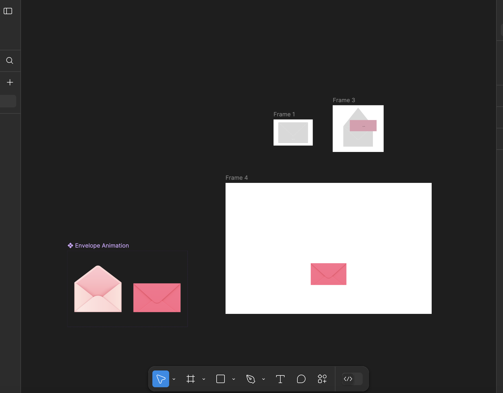

A tad bored of writing in just c# so decided that it was probably time to do small achievable side projects. This project that I am creating is just meant to be a small exercise for me. I haven't really worked with javascript in a really, really long time considering I am an infrastructure engineer working on a huge project.

The design is simple:
Have an envelope in the middle of the screen.
When you click on the envelope, a tiktok appears.
And of course the tiktok is the "WI WI WI" cat. Who I love.

Here is a video of the simple Figma I made for this because I really haven't touched anything design related in so long due to the nature of my job:

After setting up everything, this is where I got as just a proof of concept:

Silly, right?

I went back to the Figma because I wanted to expand my ability with it. So I made a component that would on click open an envelope.

Okay, and here is the final design:

